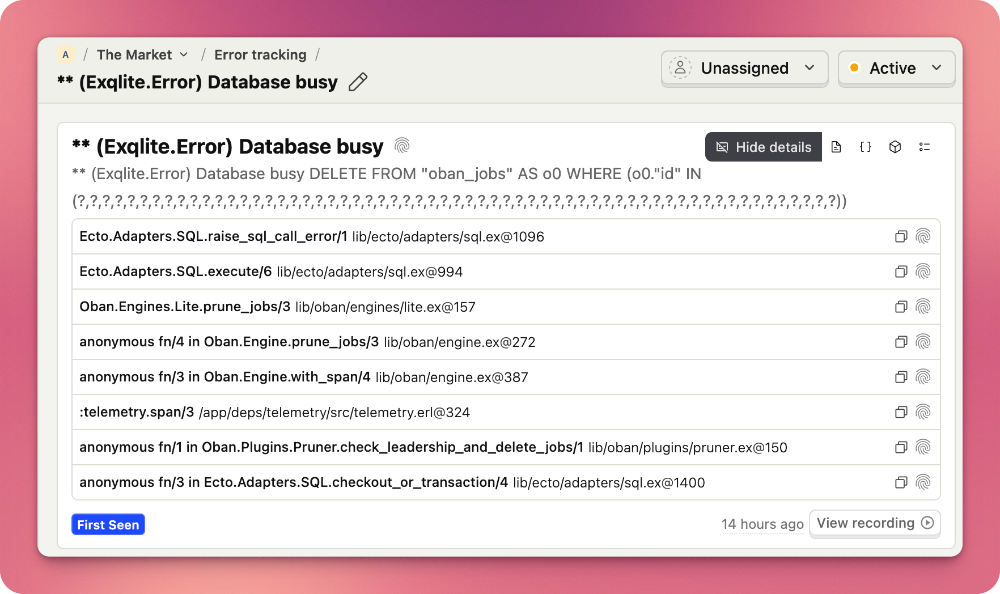

# LogHog

[PostHog Error Tracking](https://posthog.com/docs/error-tracking) for Elixir



PostHog Error Tracking is under active development, and so is this library. It
works, but there is still a long way ahead of it.

## Getting Started

Add `LogHog` to the deps:

```elixir
def deps do
  [
    {:log_hog, "~> 0.3"}
  ]
end
```

Configure `LogHog` Application environment:

```elixir
config :log_hog,
  public_url: "https://us.i.posthog.com",
  api_key: "my_api_key"
```

Alternatively, you can attach `LogHog.Handler` yourself.