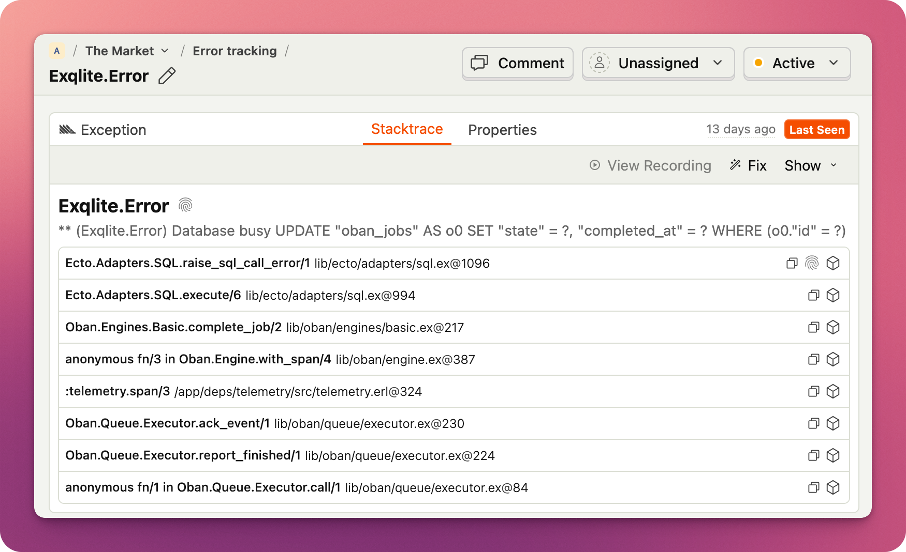

# LogHog

Unofficial PostHog Elixir SDK

## Features

* Lightweight interface
* Error tracking support
* Powerful process-based context propagation
* Asynchronous event sending with built-in batching
* Overridable HTTP client
* Support for multiple PostHog projects

## Getting Started

Add `LogHog` to your dependencies:

```elixir
def deps do
  [
    {:log_hog, "~> 0.3"}
  ]
end
```

Configure the `LogHog` application environment:

```elixir
config :log_hog,
  enable: true,
  enable_error_tracking: true,
  public_url: "https://us.i.posthog.com",
  api_key: "phc_my_api_key",
  in_app_otp_apps: [:my_app]
```

Optionally, enable [Plug integration](`LogHog.Integrations.Plug`) for better Error Tracking

You're all set! 🎉 For more information on configuration, check the `LogHog.Config` module
documentation and the [advanced configuration guide](advanced-configuration.md).

## Capturing Events

To capture an event, use `LogHog.capture/2`:

```elixir
iex> LogHog.capture("user_signed_up", %{distinct_id: "distinct_id_of_the_user"})
```

You can pass additional properties in the last argument:

```elixir
iex> LogHog.capture("user_signed_up", %{
  distinct_id: "distinct_id_of_the_user",
  login_type: "email",
  is_free_trial: true
})
```

## Special Events

`LogHog.capture/2` is very powerful and allows you to send events that have
special meaning. For example:

### Create Alias

```elixir
iex> LogHog.capture("$create_alias", %{distinct_id: "frontend_id", alias: "backend_id"})
```

### Group Analytics

```elixir
iex> LogHog.capture("$groupidentify", %{
  distinct_id: "static_string_used_for_all_group_events",
  "$group_type": "company",
  "$group_key": "company_id_in_your_db"
})
```

## Context

Carrying `distinct_id` around all the time might not be the most convenient
approach, so `LogHog` lets you store it and other properties in a _context_.
The context is stored in the `Logger` metadata, and LogHog will automatically
attach these properties to any events you capture with `LogHog.capture/3`, as long as they
happen in the same process.

```elixir
iex> LogHog.set_context(%{distinct_id: "distinct_id_of_the_user"})
iex> LogHog.capture("page_opened")
```

You can scope context by event name. In this case, it will only be attached to a specific event:

```elixir
iex> LogHog.set_event_context("sensitive_event", %{"$process_person_profile": false})
```

You can always inspect the context:

```elixir
iex> LogHog.get_context()
%{distinct_id: "distinct_id_of_the_user"}
iex> LogHog.get_event_context("sensitive_event")
%{distinct_id: "distinct_id_of_the_user", "$process_person_profile": true}
```

## Feature Flags

`LogHog.get_feature_flag/2` is a thin wrapper over the `/flags` API request:

```elixir
# With just distinct_id
iex> LogHog.get_feature_flag("distinct_id_of_the_user")
{:ok, %Req.Response{status: 200, body: %{"flags" => %{...}}}}

# With group id for group-based feature flags
iex> LogHog.get_feature_flag(%{distinct_id: "distinct_id_of_the_user", groups: %{group_type: "group_id"}})
{:ok, %Req.Response{status: 200, body: %{"flags" => %{}}}}
```

Checking for a feature flag is not a trivial operation and comes in all shapes
and sizes, so users are encouraged to write their own helper function for that.
Here's an example of what it might look like:

```elixir
defmodule MyApp.PostHogHelper do
  def feature_flag(flag_name, distinct_id \\ nil) do
    distinct_id = distinct_id || LogHog.get_context() |> Map.fetch!(:distinct_id)
    
    response = 
      case LogHog.get_feature_flag(distinct_id) do
        {:ok, %{status: 200, body: %{"flags" => %{^flag_name => %{"variant" => variant}}}}} when not is_nil(variant) -> variant
        {:ok, %{status: 200, body: %{"flags" => %{^flag_name => %{"enabled" => true}}}}} -> true
        _ -> false
      end
    
    LogHog.capture("$feature_flag_called", %{
      distinct_id: distinct_id,
      "$feature_flag": flag_name,
      "$feature_flag_response": response
    })

    LogHog.set_context(%{"$feature/#{flag_name}" => response})
    response
  end
end
```

## Error Tracking

Error Tracking is enabled by default.



You can always disable it by setting `enable_error_tracking` to false:

```elixir
config :log_hog, enable_error_tracking: false
```

## Multiple PostHog Projects

If your app works with multiple PostHog projects, LogHog can accommodate you. For
setup instructions, consult the [advanced configuration guide](advanced-configuration.md).